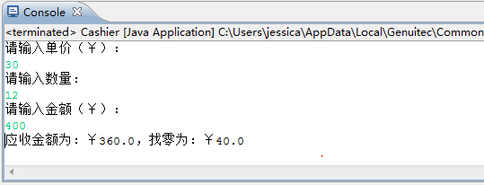

* TOC
{:toc}


#1.指出下面程序中的编译错误，并更正


int lenght=10；


System.out.println(length);


- 答：变量名错误

- 改正：


```java

int lenght=10；


System.out.println(lenght);


```


#2.指出下面程序中的编译错误，并更正


int age;


System.out.println(age);


- 答：age没有初始化

  改正


```java

int age=10;


System.out.println(age);


```


#3.运行下面程序，指出变量的输出结果


int count=30；


count=60；


System.out.println(count);


- 答：60


#4.指出下面程序中的编译错误，并更正


int &size=20；


System.out.println(&size);


- 答：不能加&,java中不存在取地址，通常创建对象后，对象的定义就是引用

  例如：'Person p = new Person();'这里的p就是Person的一个引用.

  ​	改正：


```java

int size=20；


System.out.println(size);

```


#5.指出下面程序的编译或运行结果，并解释原因


int i=128;


i = 10000000008;


System.out.println(i);


- 答：超过了int的取值范围(-2^31~2^31-1)


> 注：java中int总是4字节，在16位C编译器中，int是2字节，在32为C编译器中int为32位，在64位C编译器中int为8字节


#6.指出下面程序的运行输出结果


 doublewidth = 6.0;


 doublelength = 4.9;


 System.out.println(width- length);


 +答：没有将类型名和变量名分开

 +输出结果：1.0999999999999996（浮点误差）


#7.指出下面程序的输出结果


char ascii=98;


System.out.println(ascii);


- 答：

  输出结果：b


#8.指出下面程序中的编译错误，并更正


byte b1=10;


byte b2=20;


byte b3=b1+b2;


- 答：byte的运算，java会自动转换为int

  改正：


```java

byte b1=10;


byte b2=20;


int b3=b1+b2;


```


#9.完成收银柜台收款程序V1.0


编写一个收银柜台收款程序。根据商品单价、购买数量以及收款金额计算并输出应收金额和找零，控制台交互情况如图-1所示。





- 代码：


```java


package hello;


import java.util.*;


public class Main {

	public static void main(String[] args) {

		int number;

		double price,money;

		Scanner input = new Scanner(System.in);

		System.out.print("请输入单价（￥）");

		price = input.nextDouble();

		System.out.print("请输入数量");

		number = input.nextInt();

		System.out.print("请输入金额（￥）");

		money = input.nextDouble();

		while((money-number*price)<0)

		{

			System.out.println("金额不足！重新输入");

			money = input.nextDouble();

		}

		System.out.println("应收金额为："+number*price+",找零为："+(money-number*price));

	}

}


```


