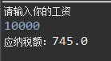

* TOC
{:toc}


#1. 编写个人所得税计算程序

个人所得税是国家对本国公民、居住在本国境内的个人的所得和境外个人来源于本国的所得征收的一种所得税。目前，北京地区的个人所得税的计算公式为：应纳税额＝（工资薪金所得－扣除数）×适用税率－速算扣除数。其中，扣除数为3500元，适用税率以及速算扣除数如下表所示。


表－1 个人所得税缴纳标准


| **全月应纳税所得额**             | **税率** | **速算扣除数(元)** |

| -------------------------------- | -------- | ------------------ |

| 全月应纳税额不超过1500元         | 3%       | 0                  |

| 全月应纳税额超过1500元至4500元   | 10%      | 105                |

| 全月应纳税额超过4500元至9000元   | 20%      | 555                |

| 全月应纳税额超过9000元至35000元  | 25%      | 1005               |

| 全月应纳税额超过35000元至55000元 | 30%      | 2755               |

| 全月应纳税额超过55000元至80000元 | 35%      | 5505               |

| 全月应纳税额超过80000元          | 45%      | 13505              |


上表中的全月应纳税所得额=工资薪金所得－扣除数。


本案例要求计算个人所得税的缴纳额度：用户从控制台输入税前工资的金额，程序计算所需要交纳的个人所得税的金额，并将计算结果输出到控制台。


程序的交互过程如图-5所示：


例如：一人一月工资为：10000元，那他需要交745.0元税收


+ 答：

+ 代码：

```java

package homework;

import java.util.*;


public class homework429 {

	@SuppressWarnings("resource")

	public static void main(String[] args)

	{

		Scanner input = new Scanner(System.in);

		double[] arr_sl= {0.03,0.1,0.2,0.25,0.3,0.35,0.45};

		int[] arr_sskcs = {0,105,555,1005,2755,5505,13505};

		double gz = 0;//工资

		int kcs = 3500;//扣除数

		int szxb = 0;//数组下标

		double ynse;


		//计算数组下标

		System.out.println("请输入你的工资");

		gz = input.nextInt();//输入工资

		if((gz-kcs)<=1500)	szxb = 0;

		else if((gz-kcs)<=4500)		szxb = 1;

		else if((gz-kcs)<=9000)		szxb = 2;

		else if((gz-kcs)<=35000)	szxb = 3;

		else if((gz-kcs)<=55000)	szxb = 4;

		else if((gz-kcs)<=80000)	szxb = 5;

		else if((gz-kcs)>80000)	szxb = 6;

		ynse = (gz - kcs)*arr_sl[szxb]-arr_sskcs[szxb];

		if(gz<3500)	

			System.out.println("应纳税额：0");

		else

			System.out.println("应纳税额："+ynse);

	}

}


```

+ 运行截图

  


#2. 输入年份和月份，输出该月的天数（使用switch-case）


一年有 12 个月，而每个月的天数是不一样的。其中，有7个月为 31 天，称为大月，分别为1、3、5、7、8、10、12月；有 4个月为 30 天，称为小月，分别为4、6、9、11月；还有二月比较特殊，平年的二月只有28天，而闰年的二月有 29 天。


+ 答：


+ 代码：


  ```java

  package homework;

  import java.util.*;

  

  public class homework429 {

  	@SuppressWarnings("resource")

  	public static void main(String[] args)

  	{

  		Scanner input = new Scanner(System.in);

  		int m = 0;

  		int pr = 0;

  		int year;

  		System.out.println("请输入年份");

  		year = input.nextInt();

  		System.out.println("请输入月份");

  		m = input.nextInt();

  	    if(year%400==0||(year%4==0&&year%100!=0))

  	    	pr = 1;

  		switch(m)

  		{

  		case 1:

  		case 3:

  		case 5:

  		case 7:

  		case 8:

  		case 10:

  		case 12:

  			System.out.println("该月天数："+31);

  			break;

  		case 4:

  		case 6:

  		case 9:

  		case 11:

  			System.out.println("该月天数："+30);

  			break;

  		case 2:

  			if(pr==1)//判断年份是否为闰

  				System.out.println("该月天数："+29);

  			else

  				System.out.println("该月天数："+28);

  

  		}

  	}

  }

  

  ```


#3. 请描述while语句的执行流程


while语句的语法格式如下：


while(表达式) {


   语句块


}


+ 答：判断表达式是否为真，如果是真的，一直循环执行语句块。直到表达式为假


#4. 指出下列程序运行后的情况


 publicstatic void main(String[] args) {


     int count=0;

    

     while(count<5);


{


         System.out.print(count+"");

    

         count++;

    

     }


 }


+ 答：卡住

+ 运行结果：`while(count<5);`后面有个;，循环无法结束，所以卡住


#5. 指出下列代码运行后的结果


 publicstatic void main(String[] args) {


     int count=10;

    

     do

    

     {

    

         System.out.print(count+"");

    

         count++;

    

     }while(count<5);


 }


+ 答：10，卡住yu'j


+ 运行结果：先执行了

```java

do{System.out.print(count+"");

   count++;}

```


  然后在while处卡主


#6. 请简述while语句和do-while语句的区别


+ 答：while先判断表达式是否为真，再执行下面的语句；do-while先执行do里面的语句再判断表达式是否为真；两个都在表达式为真时继续执行循环语句
