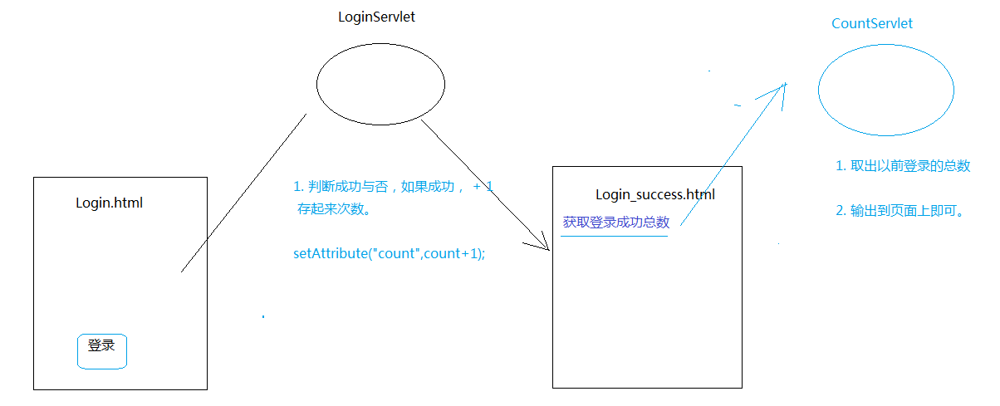

# servlet

## HTTP协议
是客户端与服务器通信的一种方式
[参考链接](https://blog.csdn.net/findsafety/article/details/47129021)
### request:
	请求行
	请求头
	请求体

### response:
	响应行
	响应头
	响应体

### Get:
GET用于信息获取，而且应该是安全的和幂等的

1. 带上数据,在URL上面拼接
	www.baidu.com
	name = zhanshan
	age = 18
	url:www.baidu.com?name = zhanshan&age = 18
	url可见
2. 传输方式
	HTTP header
3. 设计目的
	获取数据
4. 具有安全隐患,GET方法不会改变服务器端数据，所以不会产生副作用
5. GET请求返回的内容可以被浏览器缓存起来
### Post:
1. 以流的方式传输,数据无限制
	url不可见
2. 传输方式
	HTTP body
3. 设计目的
	发送数据
4. 用户可能会提交一些错误的数据
5. 浏览器不会缓存POST请求返回的内容


####　幂等（idempotent、idempotence）是一个数学或计算机学概念，常见于抽象代数中。
幂等有以下几种定义：
​	对于单目运算，如果一个运算对于在范围内的所有的一个数多次进行该运算所得的结果和进行一次该运算所得的结果是一样的，那么我们就称该运算是幂等的。 比如绝对值运算就是一个例子，在实数集中，有abs(a) = abs(abs(a)) 。
​	对于双目运算，则要求当参与运算的两个值是等值的情况下，如果满足运算结果与参与运算的两个值相等，则称该运算幂等，如求两个数的最大值的函数，有在实数集中幂等，即max(x,x) = x 。
看完上述解释后，应该可以理解GET幂等的含义了。

幂等：如果目标是当用户打开一个链接时，他可以确信从自身的角度来看没有改变资源即可。
非幂等：以新闻网站为例，读者对新闻发表自己的评论应该通过POST实现，因为在评论提交后站点的资源已经不同了，或者说资源被修改了。

### ServletConfig
写在xml文件中,一个servlet可以有多个配置信息{以servlet为单位}，同时也可以设置全局配置信息，因为可能会部署很多个servlet容器。


```xml
<servlet>
        <init-param>
            <param-name>data4</param-name>
            <param-value>value4</param-value>
        </init-param>
        <!--配置信息-->
        <servlet-name>demo</servlet-name>
        <servlet-class>main.netjava.com.servlet.example.demo</servlet-class>
    </servlet>
    
    
    <context-param>
    <!--全局：-->
    </context-param>
    
```

## web.xml
1.servlet声明
servlet:配置servlet
servlet-name：逻辑名称
servlet-class：逻辑名称对应的servlet的实际地址

servlet_mapping:servlet的对外映射
url-pattern:对外映射的路径{支持模糊匹配}
servlet支持多个url-pattern对应同一个Servlet
servlet的优先级匹配规则：
​	精确路径匹配，完全匹配
​	最长路径匹配
​	扩展名匹配
​	default匹配
​	
load-on-startup 改变Servlet的默认初始化时间
`<load-on-startup>0 <load-on-startup>`
当 它>=0,Servlet启动时就加载相应的操作
当其<0,Servlet 在客户端第一次请求servlet才加载
当有多个servlet时，数字越高，优先级越高

2.servlet的配置
servletconfig：配置信息
servlet下的init-param：
param-name：配置的key
param-value：配置的value

### 错误页面配置
```xml
<error-page>
	<error-code>404</error-code>
	<location>/404.html</location>
</error-page>
```
### 欢迎页面
```xml
<welcome-file-list>
<!--可以加很多个吗、，顺序加载一个-->
        <welcome-file>postget.html</welcome-file>
    </welcome-file-list>
```
### MIME类型映射
```xml
<mime-mapping>:定义扩展文件名隐射类型{打开文件还是下载文件}
<extension>:浏览器所要解析的文件的扩展名
<mime-type>:指定映射类型
</mime-mapping>
```
### Cookie和 Session

Cookie 保存浏览器客户端

过程：浏览器提出HTTP请求，发送给服务器后，服务器生成Cookie包含在响应头中发送给浏览器，最后浏览器会把Cookie保存起来

#### 通过setMaxAge设置cookie有效期
如果不设置，cookie会在会话结束后在内存中被销毁

Session:保存在服务器端
当浏览器发起HTTP请求时，服务器会把发送过来的数据进行逻辑处理，变成Session，并且把Session id包含在Cookie中，发送给浏览器
当下一次访问时，浏览器会根据cookie中的Session信息返回特定的http响应
#### 通过setMaxInactiveInterval设置过期时间
#### 通过invalidata使Session失效


## 通过ServletContext的动态属性方法，共享数据

## Servlet的请求转发{RequestDispatcher}
forward:将当前的request和response对象交给指定的web组件处理
必须的步骤：转发对象：
通过HttpServletRequest获取
通过ServletContext获取


###ServletContext

> Servlet 上下文

> 每个web工程都只有一个ServletContext对象。 说白了也就是不管在哪个servlet里面，获取到的这个类的对象都是同一个。

###如何得到对象

```
//1. 获取对象
	ServletContext context = getServletContext();
```

### 有什么作用

1. 获取全局配置参数
2. 获取web工程中的资源
3. 存取数据，servlet间共享数据  域对象

####.可以获取全局配置参数
```xml
<context-param>
	<param-name>address</param-name>
	<param-value>绵阳</param-value>
</context-param>
```

获取全局参数
```java
ServletContext context = getServletContext();
String address = context.getInitParameter("address");
System.out.println("这是获取的数据:"+address)
```

####. 可以获取Web应用中的资源

1. 获取资源在tomcat里面的绝对路径
先得到路径，然后自己new InpuStream
```java
		context.getRealPath("") //这里得到的是项目在tomcat里面的根目录。

		D:\tomcat\apache-tomcat-7.0.52\apache-tomcat-7.0.52\wtpwebapps\Demo03\
	
	 	String path = context.getRealPath("file/config.properties");

		D:\tomcat\apache-tomcat-7.0.52\apache-tomcat-7.0.52\wtpwebapps\Demo03\file\config.properties
```

2. getResourceAsStream 获取资源 流对象
	直接给相对的路径，然后获取流对象。
```java
//获取web工程下的资源,转化为流对象,前面隐藏当前工程的根目录
//在我们使用相对路径时,我们应该注意,有没有参照物
//这里的参照物是tomcat里面的根目录
```

### 通过classloader去获取web工程下的资源

ServletContext的目录是.tomcat里面的根目录
ClassLoder 的路径是根目录下的WEB-INF下的classer目录

### 使用ServletContext存取数据。


1. 定义一个登陆的html页面， 定义一个form表单

1. 定义一个Servlet，名为LoginServlet

1. 针对成功或者失败，进行判断，然后跳转到不一样的网页


###ServletContext存取值分析



##细节：

```
	<!-- 	
	A路径： Servlet的路径
		http://localhost:8080/Demo4/login
	
	B路径： 当前这个html的路径：
		http://localhost:8080/Demo4/login.html -->
```

​		

```
	<form action="login" method="get">
		账号:<input type="text" name="username"/><br>
		密码:<input type="text" name="password"/><br>
		<input type="submit" value="登录"/>
	</form>
```

###ServletContext 何时创建， 何时销毁?

服务器启动的时候，会为托管的每一个web应用程序，创建一个ServletContext对象

从服务器移除托管，或者是关闭服务器。 

- ServletContext 的作用范围

> 只要在这个项目里面，都可以取。 只要同一个项目。 A项目 存， 在B项目取，是取不到的？ ServletContext对象不同。

