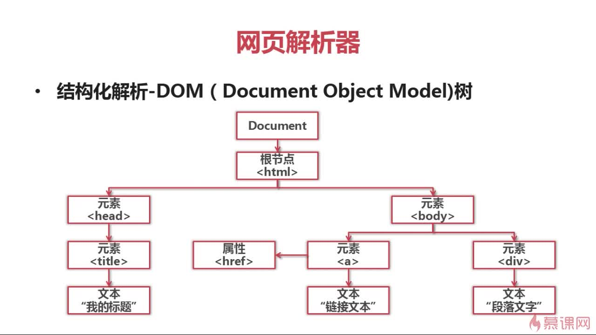
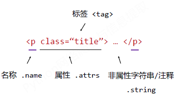
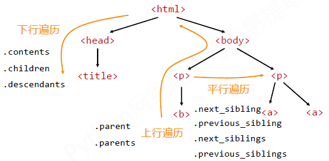
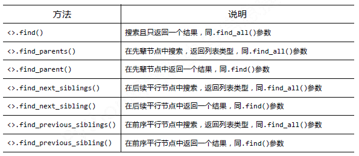

* TOC
{:toc}


## 代理
### 获取代理ip
```python
import requests

import bs4

from bs4 import BeautifulSoup


User_Agent = 'Mozilla/5.0 (Windows NT 6.3; WOW64; rv:43.0) Gecko/20100101 Firefox/43.0'

header = {}

header['User-Agent'] = User_Agent


url = 'http://www.xicidaili.com/nn/1'

r = requests.get(url,headers=header)

res = r.text


soup = BeautifulSoup(res,"html.parser")

ips = soup.findAll('tr')

f = open("./ip_proy/ip","w")


for x in range(1,len(ips)):

    ip = ips[x]#一行

    tds = ip.findAll("td")

    line = "%s:%s;%s" % (tds[1].contents[0],tds[2].contents[0],tds[5].contents[0])+"\n"

    ip_temp = tds[2].contents[0]+"\t"+tds[3].contents[0]+"\n"

    f.write(line)

    print(line)

```

### 验证能否连接

```python

#Unicode gbk

import socket

import re

import sys


import requests


#socket.setdefaulttimeout(3)#全局延时


#f2 = open("./ip_proy/run_ip", "w")

f = open("./ip_proy/ip")

lines = f.readlines()

proxys = []


for i in range(0,len(lines)):

    ip = lines[i].strip("\n").split("\t")

    ip_line = re.split(r"[.:;]",ip[0])#re.split分割

    proxy_host = "http://"+ip_line[0]+"."+ip_line[1]+"."+ip_line[2]+"."+ip_line[3]+":"+ip_line[4]

    proxy_temp = {"http":proxy_host}

    proxys.append(proxy_temp)


url = "http://ip.chinaz.com/getip.aspx"

for proxy in proxys:

    try:

        res = requests.get(url,proxies=proxy,timeout=30)

        res.encoding = res.apparent_encoding

        res = res.text

        print(proxy)

        print(res+"\n")

        '''#hava a bug

        for values in proxy.values():

        print(values)

        f2.write(str(values)+"\n")

        '''

    except:

        print(proxy)

        print("times out\n")

f.close()

#f2.close()

sys.exit()

```

## 网页解析器

#### 正则表达式

#### html.parser

#### BeautifulSoup

#### lxml

### 网页解析方法：

结构化解析-DOM树







## BeautifulSoup(最常用)


### BeautifulSoup解析器：

|解析器|使用方法|条件|

|---|---|---|

|bs4的html解析器|BeautifulSoup(html,'html.parser')|安装bs4|

|lxml的html解析器|BeautifulSoup(html,'lxml')|pip install lxml|

|lxml的xml解析器|BeautifulSoup(html,'xml')|pip install lxml|

|html5lib的解析器|BeautifulSoup(html,'html5lib')|pip install html5lib|

### 基本元素

|基本元素|说明|

|---|---|

|tag|标签,<>开头，</>结尾|

|name|标签的名字，<tag><tag>,`<tag>.name`|

|attrs|标签的属性，`<tag>.attrs`|

|NavigableString|<tag>String</tag>,`<tag>.String`|

|Comment|标签内字符串的注释部分，Comment类型|


### 搜索节点(html中的标签)

`find_all(name,attrs,recursive,string)`

name:对标签名称的检索字符串

attrs:对标签属性值的检索字符串,可棕注属性栓索

recursive:是否对子孙全部检索,默以True

string:<>..</>中字符串区域的检索字符串


#### eg:

```python

import bs4

from bs4 import BeautifulSoup

import re


html = "<body><a href='./test/123.txt'>hjhkj</a> <div class='test'>fdfdfd<div class='test'>fdfdfd</div></div></body>"

soup = BeautifulSoup(html,"html.parser")

#查找所有标签为a，链接为./test/123.txt形式的节点

m = soup.find_all('a',href=re.compile(r'./test/(.*).txt'))# (另一种写法\d+\)


#查找所有标签为div，class为test，文字为fdfdfd的节点

m=soup.find_all('div',class_='test',string = 'fdfdfd')

m = soup.div(class_='test',string = 'fdfdfd')


soup.div.attrs#tag的attrs

soup.div.parent.name#tag的父亲节点的名字

m = soup.a.string#String

#显示：

m = soup.prettify()#友好度+1


print(m)

```

###标签树的遍历

上行遍历

|属性|说明|

|---|---|

|.parent|节点的父亲标签|

|.parents|节点父辈的迭代，用来遍历父辈节点|


下行遍历

|属性|说明|

|---|---|

|.contents|tag的子节点列表|

|.children|子结点的迭代，用于循环儿子节点|

|.descendants|子孙节点的迭代，循环遍历所有子孙节点|

平行遍历

|属性|说明|

|---|---|

|.next_sibling|返回下一个平行节点的tag|

|.previous_sibling|分返回上一个平行节点|

|.next_siblings|迭代类型，返回后续所有平行节点|

|.previous_siblings|迭代类型，返回前序所有平行节点|


​       总结：

扩展方法：


### 又是实例(网上找的)

```python

# coding:utf-8

from bs4 import BeautifulSoup

import re


html_doc = """  #定义一个长字符串，存储html代码,'''可以保留格式

<html><head><title>The Dormouse's story</title></head>

<body>

<p class="title"><b>The Dormouse's story</b></p>


<p class="story">Once upon a time there were three little sisters; and their names were

<a href="http://example.com/elsie" class="sister" id="link1">Elsie</a>,

<a href="http://example.com/lacie" class="sister" id="link2">Lacie</a> and

<a href="http://example.com/tillie" class="sister" id="link3">Tillie</a>;

and they lived at the bottom of a well.</p>

http://example.com/lacie

<p class="story">...</p>

"""

soup = BeautifulSoup(html_doc, 'html.parser')#传入的html字符串；使用的解析器；编码方式

print(soup.prettify())#按照标准的缩进格式输出获取的soup内容

#提取所有的连接出来

links = soup.find_all('a')

for link in links:

    print(link.name, link['href'], link['class'], link.get_text())


#获取lacie连接

link_node = soup.find('a', href='http://example.com/lacie')

print(link_node.name, link_node['href'], link_node.get_text())


#用强大的 正则匹配

link_node = soup.find('a', href=re.compile(r"ill"))

print(link_node.name, link_node['href'], link_node.get_text())


#获取P标签

p_node = soup.find('p', class_=re.compile(r"ti"))

print(p_node.name, p_node['class'], p_node.get_text())


#抓取暗链接

link_node = soup.find_all(style='display:none;')

print(link_node)


#选择器

soup.select('title')#选择title标签

soup.select('p nth-of-type(3)')


#通过tag标签逐层查找

soup.select('body a')#查找body标签下面的a标签

#找到某个tag标签下的直接子标签：

soup.select('head>title')


#通过id来查找：

soup.select('#link1')


#通过class来查找：

soup.select('.story')

soup.select('[class~=story]')


#通过是否存在某个属性来查找：

soup.select('a[href]')


#通过属性的值来查找：

soup.select('a[href="http://example.com/lacie]')

```


## 正则RE

### 特殊字符：(使用r'string'定义字符)

```python

'.'，#点号，在默认模式中，匹配任何一个字符，除了新的行newline。如果DOTALL标记指定了，那么还可以匹配newline。

 '^'，#匹配字符串的开始

 '$'，#匹配字符串的结束。比如foo匹配foo或者foobar，但是foo$只能匹配到foo。

 '*'，#匹配0个或者多个字符，比如ab*，可以匹配a，ab，abbbb等

 '+'，#匹配1个或者多个字符，比如ab+，可以匹配ab，或者abbbb

 '?'，#匹配0或者1个字符，比如ab?只能匹配a或者ab。

'*？+'，#贪婪模式的，会尽可能多的匹配字符，

'*？+',#在后面加上一个？则会变为非贪婪模式，尽可能匹配少的字符。

#我们一般用非贪婪模式。


#m,n表示匹配的数量，如果不指定m或者n，则表示没有上限，下限不能低于0个

 '{m}',#指定匹配的数量，比如a{6}表示将匹配6个a字符，而不是5个，准确匹配。

 '{m,n}',#匹配在m~n个字符之间，包含m和n，比如a{3,5}将匹配3-5个a字符，一般会取上限来匹配。

 '{m,n}?',#非贪婪模式的匹配，尽可能匹配少，取下限m来匹配。

 '[]',#用于创造一个字符的集合，字符可以单独出现或者使用0-9，a-z这种格式。

 

 比如：

 1.[amk]会匹配a，m或者k字符。[a-z]将会匹配a-z之间的任何一个字符。[0-5][0-9]匹配从00-59的所有字符。

 2.如果在[]中包含一个特殊字符的集合，比如[(+*)]，这些特殊字符将会失去其特殊含义，只匹配字面意义，'('')''+''*'。

 3.如果在[]的开始有一个'^'，比如[^5]，将会匹配任何一个不是5的字符。


 '|',#A|B，AB是任意的RE表达式，可以匹配A或者B

 '(...)',#括号内的表达式将作为分组，从表达式左边开始每遇到一个分组的左括号，编号+1。分组表达式作为一个整体，可以后接数量词。

 比如:

 1.(abc){2}匹配abcabc，a(123|456)c匹配a456c或者a123c。


 '(?P<name>...)'，#分组，除了原有的编号外，指定一个额外的别名，比如：(?P<id>abc){2}，可以匹配abcabc，通过.'id'来访问。

 '\<number>'，#引用编号为<number>的分组匹配到的字符串。比如(\d)abc\1，可以匹配1abc1，或者5abc5

 '(?P=name)',#引用别名为<name>的分组匹配到的字符串，比如(?P<id>\d)abc(?P=id),可以匹配1abc1，5abc5等。


 '\d',#表示数字，0-9之间的一个，比如a\dc,可以匹配a1c;

 '\D',#表示非数字，也可以用[^\d]来代替，

 '\s'，#表示空白字符

 '\S'，#表示非空白字符

 '\w',#表示单词字符，[A-Za-z0-9_]

 '\W'，#表示非单词字符。

 '\A',#仅匹配字符串的开头，\Aabc可以匹配abc。

 '\Z',#仅匹配字符串结尾，abc\Z,匹配abc

```

### 方法：

### 1`re.findall(pattern,string)`

对string中所有符合pattern规则的进行匹配


### 2`re.compile(pattern,flag=0)`

返回一个对象的模式，用法：`re.compile(pattern,flag=0).findall(string)`

pattern为正则字符串

flag，匹配模式,以下可选

```

re.I #忽略大小写

re.M #多行模式

re.S #点任意匹配，

re.L #

re.U

re.X #详细模式，这个模式下正则表达式可以是多行，忽略空白字符，并可以加入注释

```


### 3`re.match(pattern, string, flags=0)`

match方法会从要匹配的string的开头开始，尝试匹配pattern，一直向后，如果遇到无法匹配的字符，就返回None，如果匹配未结束已经到达string的末尾也会返回None，表示匹配失败。匹配成功会返回True，以及匹配到的内容的group,非完全匹配，完全匹配需要在表达式末尾加上'$'

##### eg:

```python

pattern=re.compile(r'hello')

result1=re.match(pattern,'hello')

result2=re.match(pattern,'helloo world')

result3=re.match(pattern,'helo world')

result4=re.match(pattern,'hello world')


if result1:

    print(result1.group())

else:

    print('1匹配失败!')

if result2:

    print(result2.group())

else:

    print('2匹配失败!')

if result3:

    print(result3.group())

else:

    print('3匹配失败!')

if result4:

    print(result4.group())

else:

    print('4匹配失败!')


m=re.match(r'(\w+) (\w+)(?P<sign>.*)','hello world!')#单词+空格+单词+任意字符


print(m.string)#获取匹配时使用的文本

print(m.re)#获取匹配时使用的pattern对象

print(m.pos)#文本中开始搜索的位置

print(m.endpos)#返回结束搜索的位置

print(m.lastindex)#最后一个被捕获的分组在文本中的索引

print(m.lastgroup)#最后一个最捕获的分组的别名

print(m.group())#获得一个或多个分组截获的字符串，如果指定多个参数，将会以元祖形式返回

print(m.group(1,2))#指定多个参数

print(m.groups())#以元组形式返回所有分组截获的字符串

print(m.groupdict())#返回具有别名的组的别名为Key，字符串为value的字典，不包含别名的组不统计

print(m.start(2))#返回指定的组截获的子串在string中的起始索引

print(m.end(2))#返回指定的组在string中的结束索引

print(m.span(2))#返回(start(group),end(group))

```


### 4`re.search(pattern, string, flags=0)`

类似与match方法，但是match会检测re是不是在string的开始位置就能够匹配到，而search会扫描整个string来匹配。match方法只有在0位置匹配成功的话才会返回，如果不是开始i位置，即使后面由匹配，也会返回None。

##### eg:

```python

pattern=re.compile(r'world')

match=re.search(pattern,'hello world!')

if match:

    print(match.group()

```


### 5`re.split(pattern, string, maxsplit=0, flags=0)`

将string按照匹配的子串分割后返回列表，maxsplit参数指定最大分割次数，不指定的话会全部分割。

##### eg:

```python

pattern=re.compile(r'\d+')

split=re.split(pattern,'one1two2three3four4')

print(split)

```


### 6`re.findall(pattern, string, flags=0)`

搜索string，以列表的形式返回全部能匹配的子串。

##### eg:

```python

pattern = re.compile(r'\d+')

print(re.findall(pattern,'one1two23three3four4'))

```


### 7`re.finditer(pattern, string, flags=0)`

搜索string，返回一个顺序访问每一个匹配结果的迭代器

##### eg:

```python

pattern=re.compile(r'\d+')

for m in re.finditer(pattern,'one1two23three3four4'):

    print(m.group())

```


### 8`re.sub(pattern, repl, string, count=0, flags=0)`

使用repl替换string中的每一个匹配的子串后返回替换的字符串。

repl可以是一个方法，这个方法应该只接受一个match对象作为参数，并且返回一个字符串用于替换。

count可以指定最多替换次数，不指定的话就全部替换。

##### eg:

```python

pattern=re.compile(r'(\w+) (\w+)')

string='i say, hello world!'

print(re.sub(pattern,r'\2 \1',string))


def func(m):

    return m.group(1).title()+' '+m.group(2).title()

print(re.sub(pattern,func,string))

```

